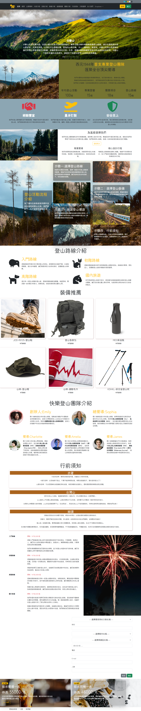
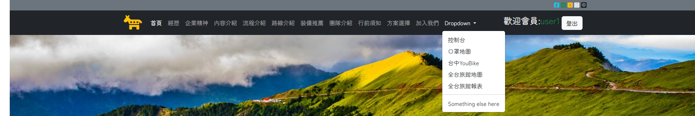
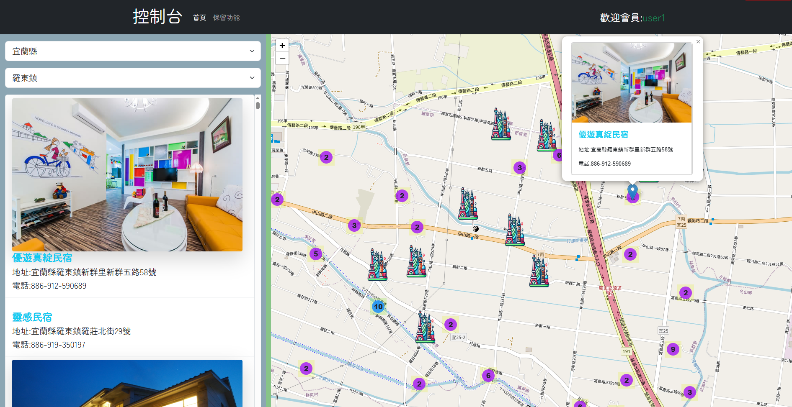
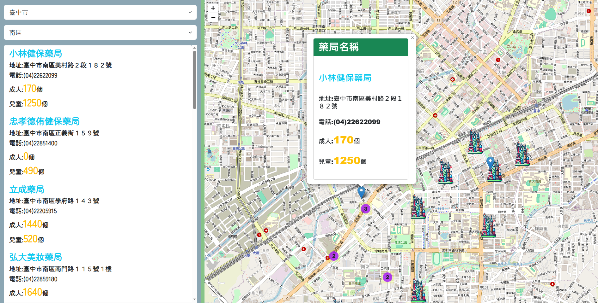
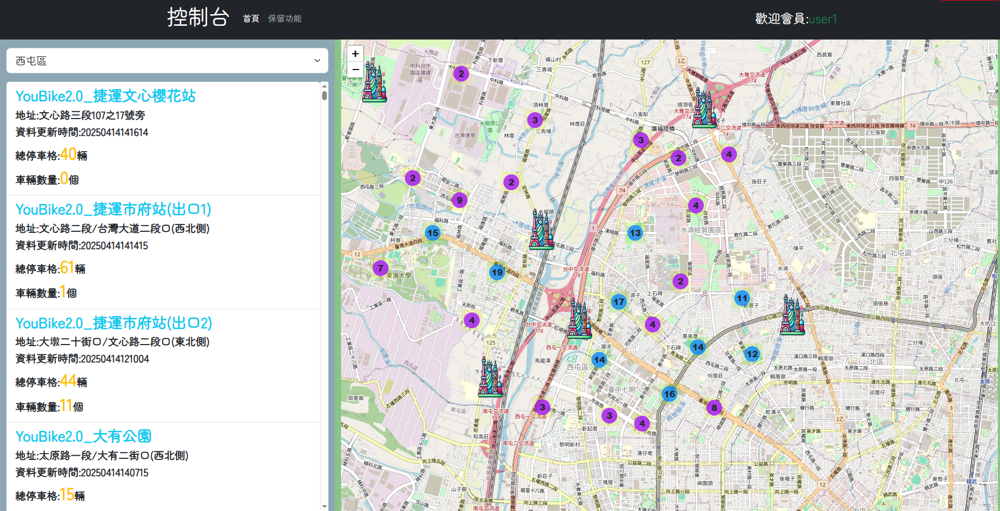
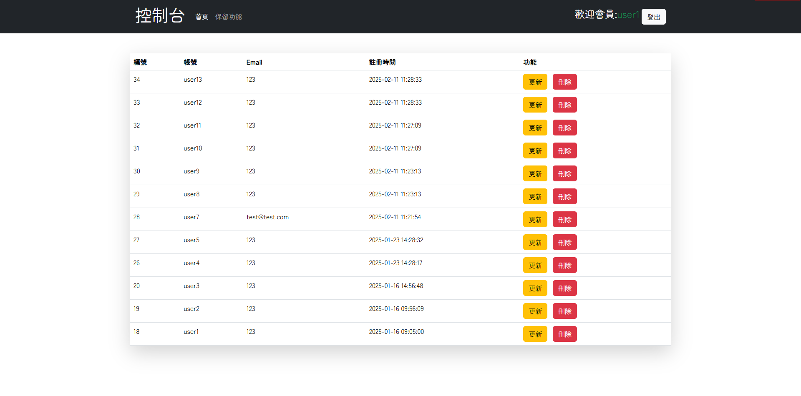
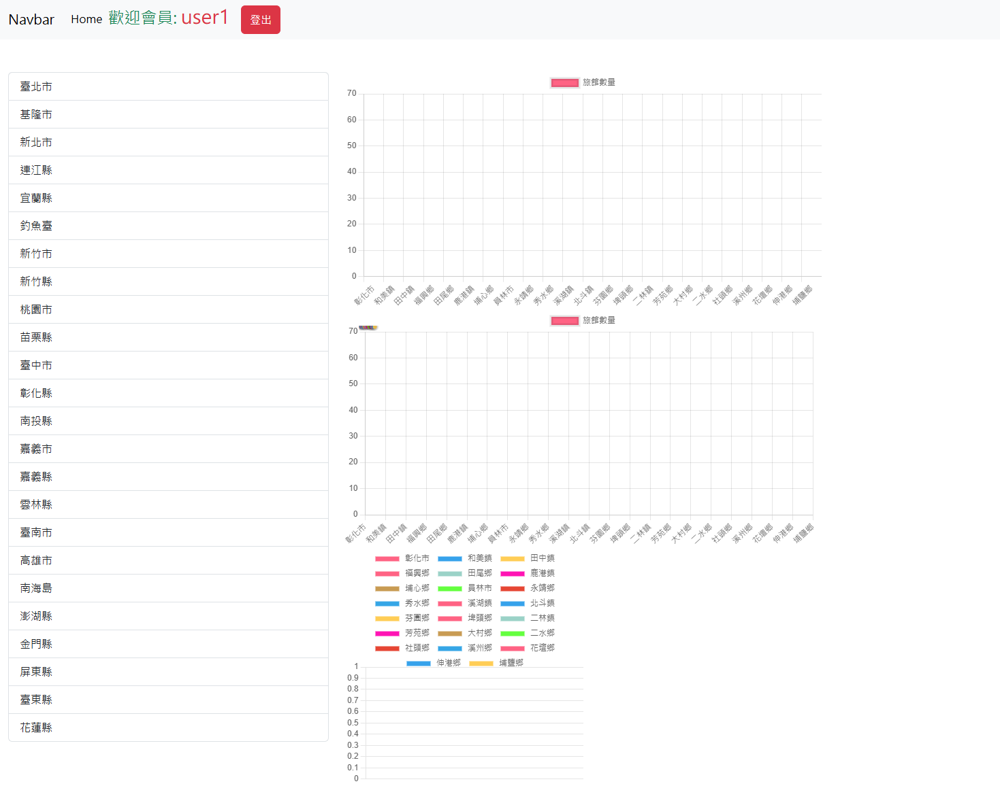

# 🏕️ SPA 快樂登山一頁式網站

這是一個結合「形象網站＋會員系統＋地圖應用＋進出貨管理」的單頁式多功能網站。除了介紹台灣的登山旅遊資訊，還提供會員登入後的實用地圖服務，如口罩即時查詢、旅館搜尋與 YouBike 自行車站點查詢等。

---

## 🌟 專案功能特色

- ✅ 一頁式登山形象網站設計
- ✅ 使用者會員註冊、登入、登出系統
- ✅ 登入後可解鎖以下進階功能：
  - 📍 全台旅館地圖查詢（含圖片與地點）
  - 🗺️ 即時口罩庫存查詢
  - 🚲 台中 YouBike 地圖查詢
- ✅ 會員後台控制台（可查詢與更新會員資訊）
- ✅ 進貨系統：建立、修改、查詢與刪除產品資訊

---

## 🧭 地圖功能比較說明

| 功能        | 口罩地圖                        | 旅館地圖                        | YouBike 地圖                  |
|-------------|----------------------------------|----------------------------------|-------------------------------|
| 📍 主要目的 | 查詢各藥局口罩庫存量             | 查詢全台合法旅館位置與資訊      | 查詢台中市 YouBike2.0 即時狀況 |
| 🗂️ 資料來源 | 健保署提供的口罩 API            | 交通部觀光局開放資料 (JSON)     | 台中市政府開放資料平台         |
| 🗺️ 地圖技術 | Leaflet + Marker Cluster        | Leaflet + Marker Cluster        | Leaflet + Marker Cluster      |
| 🔍 查詢方式 | 縣市、區域下拉選單 + 清單呈現  | 縣市、鄉鎮區選單 + 圖文顯示      | 區域選單 + 清單 + 更新時間顯示 |
| 💬 顯示資訊 | 藥局名稱、地址、電話、成人/兒童口罩數 | 旅館名稱、地址、電話、圖片        | 站點名稱、總停車格與可借車輛數 |
| 🔒 使用條件 | 會員登入後可使用                 | 會員登入後可使用                 | 會員登入後可使用               |

---

## 🛠️ 使用技術技術說明

| 類別       | 使用技術 |
|------------|----------|
| 前端框架   | HTML5, CSS3, Bootstrap 5, jQuery |
| 地圖應用   | Leaflet.js, Marker Cluster, OpenStreetMap |
| 圖表處理   | Chart.js |
| API 串接   | AJAX + JSON（資料由後端 PHP 回傳） |
| 動畫效果   | Animate.css |
| 驗證邏輯   | Cookie 登入驗證、自定義登入保護頁 |

---

## 📸 預覽畫面 Demo Screenshots

### 🏠 首頁形象登山網站

### 🔐 登入後功能選單（Dropdown 展開）

### 🧭 全台旅館查詢地圖（Leaflet）

### 🗺️ 即時口罩存量查詢地圖

### 🚲 YouBike 站點地圖查詢（台中）

### 👥 會員後台控制台（含更新與刪除）

### 📊 旅館報表（各縣市旅館數量分布）

---
## 📬 聯絡方式

如對此專案有任何建議、錯誤回報或想進一步了解，歡迎聯絡：

📧 Email：**nianyu0.n@gmail.com**

